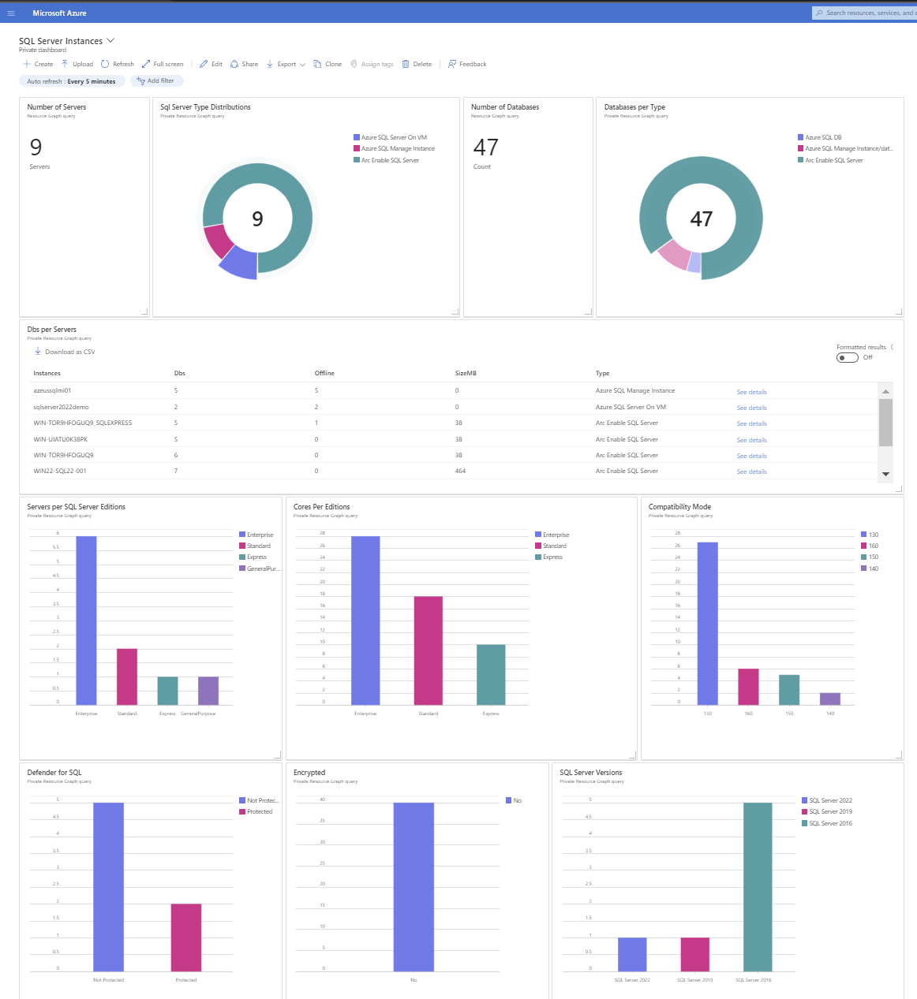

# How to Enable Azure Dashboard for ARC SQL
This article will show you how to use the [SQL Server Instances.json](SQL%20Server%20Instances.json) file to create a custom dashboard in the [Azure portal](https://learn.microsoft.com/en-us/azure/azure-portal/azure-portal-dashboards).

### Steps to Follow

1. Log in to [Azure Portal](https://portal.azure.com/)
2. Click on **Dashboard** from the Azure Portal menu. You may already see the dashboard view by default.

3. Choose **Upload**.

4. If you want to edit the dashboard, please refer to this [link](https://learn.microsoft.com/en-us/azure/azure-portal/azure-portal-dashboards#edit-a-dashboard).

## Disclaimers
The code included in this sample is not intended to be a set of best practices on how to build scalable enterprise grade applications. This is beyond the scope of this quick start sample.
